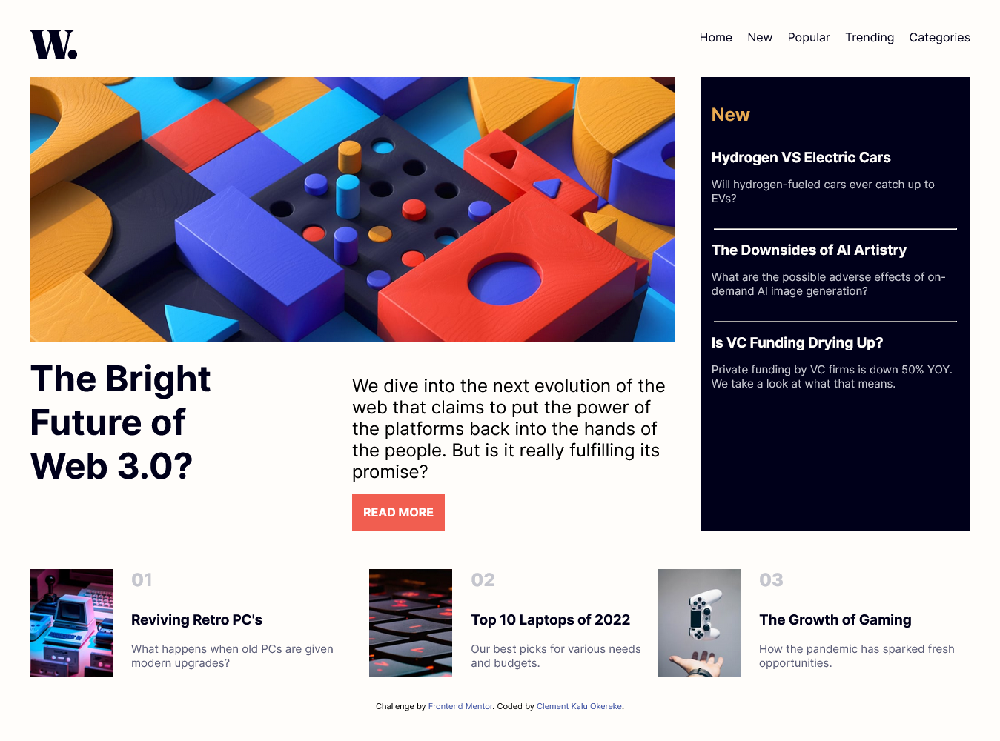

# Frontend Mentor - News homepage solution

This is a solution to the [News homepage challenge on Frontend Mentor](https://www.frontendmentor.io/challenges/news-homepage-H6SWTa1MFl). Frontend Mentor challenges help you improve your coding skills by building realistic projects.

## Table of contents

- [Frontend Mentor - News homepage solution](#frontend-mentor---news-homepage-solution)
  - [Table of contents](#table-of-contents)
  - [Overview](#overview)
    - [The challenge](#the-challenge)
    - [Screenshot](#screenshot)
    - [Links](#links)
  - [My process](#my-process)
    - [Built with](#built-with)
    - [What I learned](#what-i-learned)
  - [Author](#author)

## Overview

### The challenge

The challenge is to build out this news website homepage and get it looking as close to the design as possible.
Users should be able to:

- View the optimal layout for the interface depending on their device's screen size

- See hover and focus states for all interactive elements on the page

- **Bonus**: Toggle the mobile menu (requires some JavaScript)

### Screenshot

### Links

- Solution URL: [Add solution URL here](https://your-solution-url.com)

- Live Site URL: [News App Live Site](https://news-app-main.netlify.app/)

## My process

### Built with

- Semantic HTML5 markup
- CSS custom properties
- CSS FlexBox
- CSS Grid
- Mobile-first workflow
  
### What I learned

I learned the basics of Accessibility in a webpage
  
## Author

- Website - [Clement Kalu Okereke](https://clement-portfolio.w3spaces.com)
- Frontend Mentor - [@Clement1kalu-okereke](https://www.frontendmentor.io/profile/Clement1kalu-okereke)
- Twitter - [@ClementKaluoke2](https://www.twitter.com/ClementKaluoke2)
  
